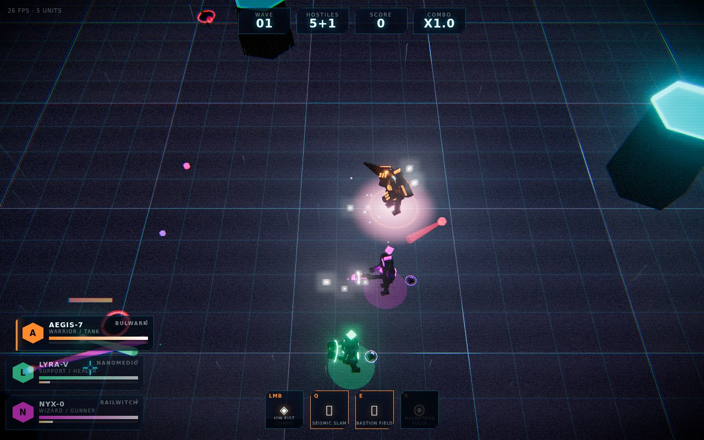

<div align="center">

# NEON VANGUARD

**3D top-down cyberpunk squad action that runs in a browser tab.**
Three switchable operatives · wave survival · procedural everything · **zero asset files**.

[**▶ Play**](./neon-vanguard.html) &nbsp;·&nbsp; [**Character Bay**](./character-bay.html) &nbsp;·&nbsp; [**Hero Studio**](./hero-studio.html) &nbsp;·&nbsp; [**Handoff**](./HANDOFF.md) &nbsp;·&nbsp; [**Proposal**](./NEON-VANGUARD-PROPOSAL.md) &nbsp;·&nbsp; [**Review**](./NEON-VANGUARD-REVIEW.md)



</div>

> **New here (human or AI)?** Read **[`HANDOFF.md`](./HANDOFF.md)** first — orientation, architecture
> invariants, the traps that cost time to find, and the prioritised backlog. This README is the developer
> quick reference.

Built with **three.js r169**. You pilot one of three operatives; the other two fight as AI. Swap mid-combo,
chain ultimates across all three, draft implants between waves, and survive. Every polygon, texture,
animation, sound effect and music cue is generated at runtime.

## Builds

| File | What it is |
|---|---|
| `neon-vanguard.html` | the game — 3 switchable operatives, waves, boss, ultimate chain, audio |
| `character-bay.html` | character turntable viewer — orbit, poses, weapon detail, ability preview, and live Hero Studio GLB library |
| `hero-studio.html` | Hero Studio — tune uploaded skins (size / placement / motion) and edit each hero's skill effects |
| `concept/*.jpg` | rendered concept sheets (art-direction target for Phase 3) |
| `models/ref/` | bind-pose sheets for the three heroes + **`RIG-SPEC.md`**, the contract a rigged `.glb` must satisfy to animate |

## Play it

* **Zero setup:** open `neon-vanguard.html` — one self-contained 618 KB file, no server, no network.
* **Or serve it:** `python3 -m http.server 8080 --directory .`

### Controls

| Input | Action |
|---|---|
| `WASD` / arrows | Move |
| Mouse | Aim / ground-target |
| Hold `LMB` | Basic attack |
| `Q` `E` | Skills |
| `R` | Ultimate (requires full charge) |
| `Space` | Dash |
| `1` `2` `3` / `Tab` | Switch operative (the other two fight as AI) |
| `P` | Pause |
| `M` | Mute / unmute (or the widget top-right) |

**Ultimate chain:** kills drop charge shards; every 16 kills a **Charge Core** drops that fills all three
ultimates. Fire an ult, swap, fire again within 6.5 s — ×2 is +45% ult damage, all three is **Trinity
Overdrive** (bullet-time, refreshed kit, arena-wide detonation).

**Options** (menu or pause): master/music/SFX volume, FX intensity, screen shake, colour-blind-safe hostile
palette, damage-number toggle. Settings and your personal best persist in `localStorage`.

**Combat feel:** every hostile telegraphs its attack on the ground before it lands — **stunning an enemy
mid-wind-up cancels the attack entirely**. Dash has 0.20 s of i-frames; a clean dodge pays back ult charge.
Heavy blows trigger hit-stop. From wave 6 the deck discharges telegraphed grid zones that hurt both sides.

**Training:** a gated wave 0 runs on your first visit (or from the menu). `K` skips it.

**Implant draft:** clear a wave and pick 1 of 3 implants (mouse, `1`/`2`/`3`, or gamepad). `ESC` skips for
+300. 21 implants across squad stats, run mechanics and per-hero ability rewrites; rarity-weighted with
stack caps. Your build shows on the pause screen and the end-of-run summary.

**Lyra's drone:** aim within 2.8 m of an ally to **lock** the repair drone onto them — 17 HP/s instead of the
6 HP/s passive, and overheal banks as shield. The reticle turns mint when locked.

**Gamepad:** left stick move, right stick aim, RT fire, B dash, X/Y skills, LT ultimate, d-pad switch, Start pause.

**Character Bay controls:** drag to orbit · scroll to zoom · `1 2 3` switch · `Space` fire signature ·
`F` toggles **FOLLOW** (keeps the subject framed) / **FREE VIEW** (keeps your composition) ·
pose buttons drive the procedural rig or matching clips on an uploaded GLB (idle / move / attack / cast / downed).
The Bay polls Hero Studio's upload library and adds new body GLBs as tabs while it stays open.

**Hero Studio camera:** use the **FOLLOW** / **FREE VIEW** buttons beside the pose controls, or press `F`.
Follow keeps the active hero centred while CAST SIM moves it; Free View preserves a hand-built
OrbitControls composition. Auto-spin is independent, but Free View turns it off when switching modes.

**Hero Studio workflow:** edits show as **UNSAVED**; use **APPLY + REBUILD PREVIEW** after changing a skin or
clip binding, **RESET HERO** to restore the values loaded for the selected hero, **EXPORT JSON** to download a
portable tuning file, **IMPORT JSON** to load one back into the editor, then **SAVE** to send the config to the
upload server.

## Develop

```bash
npm install          # three + esbuild (+ puppeteer for the smoke test)
node build.mjs       # bundles src/ into neon-vanguard / character-bay / hero-studio .html

# headless — plain Node, no browser, run these first
node tools/lighttest.mjs # 37 assertions: the scene's point-light count never changes
node tools/geocheck.mjs  # per-enemy draw calls / verts / bbox / lights / materials, pooling leak check
node tools/instancetest.mjs # static enemy shells batch into InstancedMesh objects at the live cap
node tools/fxtest.mjs     # FX quality profiles enforce particle / ring / beam / spark budgets
node tools/contenttest.mjs # arena layout and enemy-variant data contracts
node tools/glbtest.mjs   # 25 assertions: the shared GLB pipeline (export->parse->normalise->stats)
node tools/skintest.mjs  # 173 assertions: uploaded skins, hero_tuning.json v1→v3, per-skill FX slots + pooling,
                       #   the clip resolver, the mixer (and its absence), the boot clip report
node tools/herofit.mjs   # 18 assertions: every uploaded GLB stands fully on the deck (feet at y = 0)
node tools/simtest.mjs   # 56 assertions: the cast bench — 9 abilities + basics run, expire and leak nothing
node tools/animcheck.mjs # read-only review of the motion layer: feet vs deck, GLB slam float, clips per file
node tools/fxsample.mjs  # writes + validates the AEGIS sample skill FX (see FX-AEGIS.md)
node tools/uploadstats.mjs # tri / mesh / texture cost of every GLB in models/uploads/

# headless art loop — look at the characters without a browser
node tools/charpreview.mjs [aegis|lyra|nyx|all]        # run the real rig + animator, dump tris to JSON
python3 tools/render.py .tmpbuild/char-<id>.json o.png # rasterise that JSON to a PNG

# browser — need puppeteer + a Chrome
node tools/smoke.mjs     # headless playthrough: catches runtime errors, writes ability screenshots
node tools/combotest.mjs # verifies charge cores + x2 link + Trinity Overdrive
node tools/audiotest.mjs # verifies all 38 SFX cues produce signal
node tools/bayshots.mjs  # re-renders the character sheets in screenshots/
node tools/p0test.mjs    # telegraphs, i-frames, elites, settings, persistence, run summary
node tools/phase1test.mjs # training gates, hit-stop, occlusion fade, drone lock
node tools/drafttest.mjs # implant draft: offers, apply, stacking, skip
node tools/devtest.mjs   # dev overlay: sliders reach gameplay, cheats, export/reset
```

For the human pass, use **[`PLAYTEST-CHECKLIST.md`](PLAYTEST-CHECKLIST.md)**. It covers the game, Character Bay,
Hero Studio, and a 15-minute outside-playtest script. Browser automation additionally needs a local Chrome
executable; Puppeteer alone is not enough.

Source layout:

```
src/main.js      bootstrap, post-processing chain, input, camera, wave director, shared game context `G`
src/world.js     arena layouts, floor shader, skyline, holo billboards, rain, cover pylons
src/fx.js        quality-bounded particles / rings / beams / sparks, camera shake, screen flash
src/audio.js     WebAudio synth toolkit, 38 SFX cues, adaptive synthwave sequencer, mix + ducking
src/rig.js       procedural humanoid rig + animator + weapon builders
src/heroes.js    hero data, all 12 abilities, buffs, squad AI
src/entities.js  instanced enemy shells, animated accents, projectile pool, enemy types, steering, boss
src/pickups.js   charge shards + Charge Cores (magnet, beacon, squad overcharge)
src/lights.js    fixed-size PointLight pool — keeps the scene's light count constant
src/upgrades.js  implant definitions + rarity-weighted draft roller (writes into G.mods)
src/balance.js   every tunable number + ranges for the overlay + applyBalance()
src/devtools.js  the dev overlay (backtick): sliders, cheats, perf, JSON round-trip
src/showcase.js  Character Bay entry point (studio lighting, turntable, pose driver, live uploaded GLB library)
src/gltfutil.js  DOM-free GLB parse / stats / normalise (shared by Character Bay, Hero Studio + glbtest)
src/glbskin.js   loads uploaded hero GLBs + their clips, models/uploads/hero_tuning.json (v3), and prints
               the boot clip report — what bound, what is not in the file, what one clip two slots claimed
src/fxpack.js    skill-effect layer: per-skill slots, parameter clamping, pooled clones, video + light reuse
src/studio.js    Hero Studio entry: size / placement / action-motion / per-skill FX editor → hero_tuning.json
src/sim.js       CAST SIM — the studio bench: real useSkill() + real move()/update() + real FX against stand-in
                 targets, MOVE + dash, slow-mo
src/ui.js        HUD binding (DOM overlay)
src/util.js      math / material / procedural-texture helpers
```

### Notes for whoever picks this up

* **Everything is pooled.** Particles (6 000), rings, beams, projectiles and floating combat text all come
  from fixed pools — never allocate inside the frame loop.
* **A clamp pass runs before the bloom.** A single overflowing additive pixel becomes `Inf`, spreads through
  the bloom mip chain and blacks out the entire frame. `ClampShader` in `main.js` kills NaN and clamps to 12.0.
  Don't remove it.
* **Abilities are coroutines:** `G.addEffect({ update(dt) { ...; return stillAlive; } })`.
* **Heroes and enemies are data** (`HERO_DEFS`, `ENEMY_TYPES`) — adding content shouldn't touch engine code.
* `?shot=1` in the URL enables `preserveDrawingBuffer` for headless screenshots.
* **Enemies are pooled per type.** `spawnEnemy` reuses an instance via `reset()` rather than rebuilding the
  mesh tree; overflow calls `disposeMeshes()`. Don't `new Enemy()` in gameplay code.
* **Uploaded skill effects borrow, they never own.** `fxpack.spawnFX()` pulls a subtree from a per-file free
  list, reuses cached material sets, shares one `<video>` + `VideoTexture` per clip (refcounted) and borrows a
  light from the fixed pool. So: never `disposeObj()` a spawned effect, and never `dispose()` its materials
  either — call `kill()` (idempotent, wired to the coroutine's `dispose()` so a run reset releases it too).
* **Telegraphs come from a pool too** (`fx.telegraph` / `tellSet` / `tellRelease`). Always release on death
  or interrupt or you will starve the pool of 28.
* Particle counts pass through `fx.pMul` and shake through `fx.shakeMul` — both driven by the settings.
* **Hit-stop** goes through `G.punch(seconds)` — capped at 0.10 s and non-stacking. It multiplies `dt`, so
  never decrement a timer that should survive it with the scaled `dt`.
* **All upgrade effects read `G.mods`** (see `MOD_DEFAULTS`). If you add an implant, wire it to a real call
  site in the same commit — the pool is deliberately free of cosmetic stats.
* **Never `new THREE.PointLight()` in gameplay code.** three.js bakes the light *count* into its shader
  program cache key, so one light appearing or disappearing recompiles every material in the frame.
  Enemies, pickups and abilities borrow from `G.lights` (a fixed pool built once at boot); unused slots
  stay `visible` at intensity 0. `acquire()` returns `null` when a kind is exhausted, so guard every
  `light.intensity = …`. `node tools/lighttest.mjs` asserts the whole thing.
* **Characters are faceted plate armour, not smooth primitives.** `rig.js` builds plates with `chamfer()`
  (a beveled extrude) and limbs with tapered hexagonal `seg()`, and the metal materials use
  `flatShading` — that combination is the whole hard-surface read. Iterate with the headless art loop
  (`charpreview.mjs` + `render.py`) and compare against `concept/*.jpg`, never live-game frames.
* Arena hazards borrow the telegraph pool. They keep their decal through the discharge phase and release it
  on cleanup — check `fx.tellPool.length` returns to 28 if you touch that code.

### Dev overlay

Press **backtick** (or `F2`) in-game for the tuning overlay: live sliders over every value in
`src/balance.js`, cheats (skip wave / spawn boss / kill all / force draft / full charge / god / slow-mo),
a perf readout (frame time, fps, draw calls, triangles) and JSON round-trip.

**Tuning workflow:** play → drag sliders → *Copy JSON* → paste into `src/balance.js` → commit. An open
session persists across reloads in `localStorage`; *Reset* clears it.

`src/balance.js` is the single source of truth — don't reintroduce balance literals into gameplay files.
`applyBalance()` pushes values into `HERO_DEFS` / `ENEMY_TYPES`.

### Hero Studio — skins, skill effects and GPU VFX

The **GPU VFX · THREE-VFX STYLE** section is a vanilla-three editor inspired by the upstream `three-vfx` particle model. The upstream package is React/R3F-oriented and still marked work-in-progress, so this build keeps a serialisable profile and a renderer-native adapter: one instanced mesh per effect, with lifetime, velocity, acceleration, scale, colour and opacity animated in the GPU shader. Select **ALL / Q / E / R**, tune the profile, press **▶ PREVIEW** to judge it without changing gameplay, then press **ENABLE IN GAME**, **SAVE**, and restart the run. The preview and match both call `src/vfx.js:spawnVFX()`, so there is no separate effect implementation to drift.

> Want a worked example with real files? **[`FX-AEGIS.md`](FX-AEGIS.md)** — four sample skill effects for
> AEGIS (in `models/uploads/`), the assign → tune → save loop, what `● REC` records, and every FX slider with
> its range. Regenerate them with `node tools/fxsample.mjs`.
>
> The layer *under* the FX — how a hero is posed, how it walks, how an attack starts — is reviewed in
> **[`MOTION-AUDIT.md`](MOTION-AUDIT.md)**; `node tools/animcheck.mjs` re-measures its numbers (and refuses to
> pass if a per-frame path starts allocating again).

`hero-studio.html` is the art-direction side of the upload pipeline. It boots the real `Hero` class with the
GLBs from `models/uploads/`, so what you see is what the match will draw. Everything is written to
`models/uploads/hero_tuning.json`, which the game re-reads on every `startGame()` — tune, SAVE, then
restart the run; no page reload. **IMPORT JSON** loads a portable tuning file into the editor (it accepts the
file produced by **EXPORT JSON** or a `{ "tuning": { ... } }` wrapper); imported skin and clip choices wait
for **APPLY + REBUILD PREVIEW**, while size, placement, motion, and FX fields preview immediately. Files already
parsed are reused, so a restart only pays for what changed. That file is gitignored — it is this workspace's
session, not the game; `git add -f` it when a setup is worth shipping. At boot the game prints what it made of it:
`[clips] aegis (aegis-rig.glb): bound idle=Aegis Idle walk=Walk … NOT IN FILE: Run02`, a warning line only when
something failed to bind, so a shipped tuning file that names a clip the file does not have says so where it is
actually played.
Two rows at the top of the panel decide what the hero *is*: **SKIN FILE** points a hero at any `.glb` in the
dropbox instead of `models/uploads/<id>.glb`, and **CLIPS** binds that file's animation clips to the hero's
five states (`auto` resolves by name; `clips on/off` ignores them entirely and gives you the v2 behaviour). A
file with no clips — which is every file in `models/uploads/` today — keeps the transform layer it always had.

**Character Bay follows the same library.** Keep it open while Hero Studio uploads or overwrites a body GLB: it polls the upload list and tuning file, adds new unassigned body files as `UPLOADED GLB` tabs, and applies saved hero skin assignments to AEGIS / LYRA / NYX automatically. Skill-effect files ending in `-fx.glb` or `-sN-fx.glb` stay out of the body roster.

The panel ends in a **CAST SIM**: `basic · Q · E · R · ⟳ auto`, 0/3/6 targets, `1× · ½× · ¼×` slow motion and a
**MOVE** row (`idle · walk · strafe · circle` + `dash`). It calls the real `Hero.useSkill` *and* the real
`Hero.move`/`Hero.update`, so you judge an uploaded effect against the ability's own rings, particles, shake,
knockback and footwork instead of on an empty stage — a slam that carries the hero 1.18 m carries your FX along
with it if its `anchor` row says *follow hero*. Turning the bench on hands the body over to the hero: the `ACTION`
buttons can only overlay a pose, and walk speed is measured off real velocity rather than assumed.

Placement needs that framing: a GLB exported around its own centre is *fitted* by the loader (centred, lifted
by half its height), and `pos` is an **adjustment** on top of it — not an absolute position. The same lift is
carried through the size multiplier, so scaling a hero to 1.35 still leaves its feet on the deck. `node
tools/herofit.mjs` measures the real `models/uploads/*.glb` and asserts it.

```bash
python3 -m http.server 8080 --bind 0.0.0.0 --directory . &   # the pages
python3 tools/upload_server.py                                # the :8081 dropbox (save + file list)
```

| Panel | Writes |
|---|---|
| SIZE / PLACEMENT (x, y, z, yaw) | `scale`, `pos`, `yawDeg` — offsets sit **on top of** the loader's own fit, so 0/0/0 is already right; sliders + type-in boxes, a feet/head readout, `auto-lift` and `reset` |
| ACTION MOTION | `motion` — step rate, bob, lean, lunge, twist, cast lean, hurt recoil, recoil kick, idle sway, fall speed |
| SKILL EFFECT | `fx` / `fxOn` / `fxP` (the shared slot) and `fxSlots[0..2]` — one effect per skill, Q / E / R; legacy GLB/video slots also accept an optional audio cue |
| LIBRARY · models/uploads | `▶` previews any file at the hero **without assigning it** (params via `fxPreviewFor`, always a clamped copy), `⟳ loop` re-fires it, `all · glb · video` filters |
| GPU VFX · THREE-VFX STYLE | `ALL / Q / E / R` profile slots, preview/enable/save, plus an additive audio cue with volume/rate controls and `.ogg / .wav / .mp3` upload, preview, assign, and clear |

### Skill FX audio

The best match found for this neon sci-fi combat game is **[Kenney Sci-Fi Sounds](https://kenney.nl/assets/sci-fi-sounds)**:
70 normalized OGG effects for engines, explosions, lasers and space sounds, released under **CC0**. OGG is a good browser target because it can be decoded by the existing Web Audio path. The official download is
[`kenney_sci-fi-sounds.zip`](https://kenney.nl/media/pages/assets/sci-fi-sounds/6b296f9ecf-1677589334/kenney_sci-fi-sounds.zip).
A second compatible option is OpenGameArt's [50 CC0 Sci-Fi SFX pack](https://opengameart.org/content/50-cc0-sci-fi-sfx), which adds retro lasers, rockets, teleports and terminal/synth cues.

The editor does not require either pack to be committed to the repository: download the pack, open **Hero Studio**, select **GPU VFX → ALL / Q / E / R**, then drop an OGG/WAV/MP3 into the **audio cue** box. It uploads to `models/uploads/`, lists and previews it, and saves the selected relative URL in the same VFX profile as the particle look. `▶ preview` uses the same Web Audio decoder as the match; **SAVE + ENABLE** makes the cue play with that skill. Missing or undecodable samples are silent, so the existing procedural SFX remains the fallback.

An effect is a **`.glb` prop** or a **video billboard** (`.mp4` / `.webm` / `.ogv`). Drop it on the panel,
record it from the studio canvas (`● REC` captures the slot's own playback and saves `<id>-s<n>-fx.webm`),
or pick a file already in `models/uploads/` from the LIBRARY list — that path needs no re-upload, and
because the effect bank is keyed by **URL**, the same file can serve several heroes or slots for free.

Config shape (v2; a v1 file still loads — its hero-wide `fx` becomes the shared slot):

```json
{ "aegis": {
    "scale": 1.0, "pos": { "x": 0, "y": 0, "z": 0 }, "yawDeg": 0, "motion": { "bob": 0.06 },
    "fx": "models/uploads/aegis-fx.glb", "fxOn": true, "fxP": { "scale": 1.2, "tint": "#ff8a2b" },
    "fxSlots": [null, { "src": "models/uploads/aegis-s1-fx.glb", "on": true, "p": { "y": 0.4 } }, null]
} }
```

A slot entry's `p` block is the whole look: `scale y dur grow spin rise fade opacity light` (+ `tint`),
`blend` for props, `rate vblend face loop` for video. Every value is clamped in
`fxpack.clampFX()` when the file is read, so a hand-edited JSON cannot push a NaN into the bloom chain.
Resolving one cast is `fxpack.fxFor(tuning, heroId, slot)`: a per-skill entry wins, otherwise the shared
`fx` plays, otherwise nothing — and `Hero.playFX(G, i)` is called with the skill index from `useSkill`.

### Combat content

The run now rotates three reusable arena layouts — **NEON GRID**, **CROSSFIRE**, and **DEADZONE** — between
waves. Wave 1–10 mixes the original SKITTER / BRUTE / SENTINEL roster with the fast melee **CHARGER FRAME**
and ranged **WARDEN BEACON**, then continues scaling with elites and the ONI-CLASS JUGGERNAUT. New enemy art
is not required for these two variants: their tuned silhouettes reuse the existing brute and sentinel construction
while their speed, range, telegraph, and damage profiles create different threats.

### Render budget

* **Static geometry is baked at build time.** `bakeStatics()` in `entities.js` merges every non-animated
  child that shares a material. Flag anything you animate with `userData.animated = 1` or it will be
  swallowed into the merge.
* **Enemy materials are shared per type** (`SHARED_MATS`). Never mutate them per instance — per-instance
  glow lives on the separate `glowMats` list.
* **Enemy shells are instanced per type.** `EnemyStaticBatch` submits the baked shell/dark body once per
  type; animated accents, health bars, crowns, and telegraphs remain on each enemy. `node tools/instancetest.mjs`
  checks the live-cap batch slots and transform updates.
* **`disposeObj(scene, obj)`** for anything an ability builds at cast time. `scene.remove()` alone leaks.
* An **adaptive governor** trims the enemy cap and FX quality profile when frame time exceeds 24 ms and
  restores them below 14 ms. It never exceeds the player's FX setting.
* **FX quality is a hard admission budget**, not only a multiplier: Low / Normal / Cinematic bound live
  particles, rings, beams, and spark streaks. Dropped admissions are counted in `fx.budgetStats()` instead
  of overwriting live effects. `node tools/fxtest.mjs` checks the low-quality ceiling.
* To verify a geometry optimisation, compare **vertex count and world bounding box** before/after — image
  diffs of a live game are meaningless.

### Audio notes

* **Schedule with lookahead.** Cues fire at `currentTime + 20 ms`. Scheduling into the current render
  quantum truncates short envelopes — a punch loses its body and sounds like a click.
* **Per-cue levels live in `AudioEngine.LEVELS`**, calibrated with an offline peak meter, not by ear-guessing
  individual oscillator gains. Frequent cues 0.04–0.13, combat 0.15–0.35, ultimates 0.5–0.99.
* **Music intensity** is driven from `startWave()`: `SFX.setIntensity(0…4)` unlocks pad → bass/kick →
  snare/hats/arp → lead. Ultimates call `SFX.duck()`.
* `node tools/audiotest.mjs` verifies every cue produces signal and reports the master-bus peak.
  Measure levels in an **isolated page** — a `ScriptProcessor` meter reads low when the 3D loop saturates
  the main thread.
