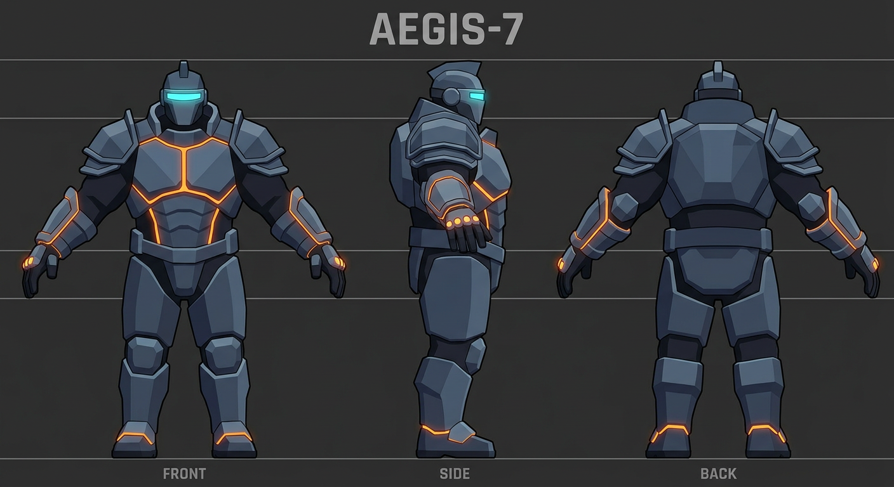
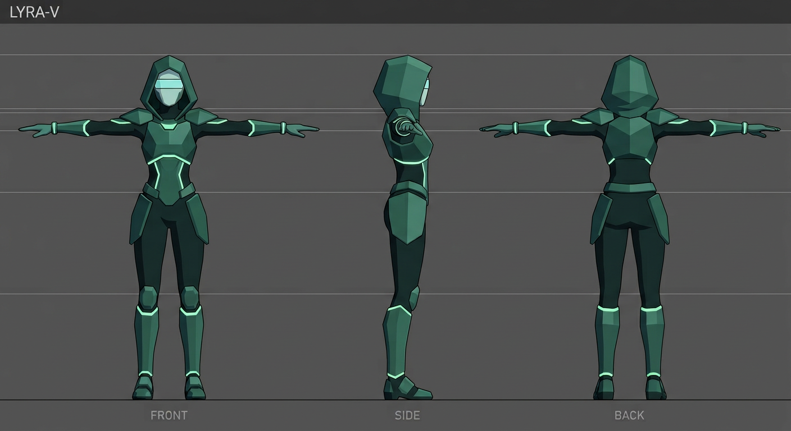
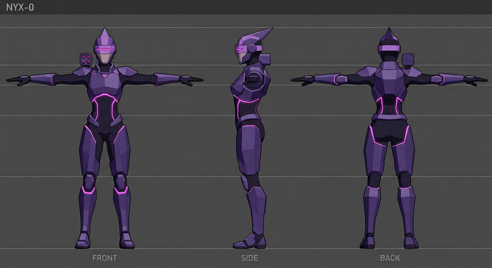

# RIGGING A HERO GLB — what the game already listens for

Everything on this page is read off the shipping code (`src/glbskin.js`, `src/gltfutil.js`,
`src/heroes.js`, `src/studio.js`), not off a wish list. Nothing here needs a code change to
work: the loader, the mixer, the five clip slots, the studio rows and the fit measurement are
all in and tested. What is missing is a file worth loading.

**The current state, plainly:** `node tools/animcheck.mjs` prints a census of `models/uploads/`
and every real hero file says `bones 0 · skinned 0 · clips 0` — static meshes. The one rigged
file in the folder, `aegis-rig.glb`, is a generated stand-in (`node tools/riggeddemo.mjs` writes
it: 3 bones, 4 clips, 9 KB) and exists so the paths below can be exercised. An actual hero from
art is the last thing between this project and animated skins.

## The six rules that decide whether it works

1. **One `.glb`, in `models/uploads/`, named `<hero>.glb`** (`aegis`, `lyra`, `nyx`). Not `.gltf`
   plus sidecars — the loader fetches one URL.
2. **Metres, +Y up, the model facing +Z, bind pose with the arms out.**
3. **All animation on bones. Never on the mesh root** (see *Root* below — this is the one that
   bites hardest and the one nobody expects).
4. **Clips named after the state**: `Idle`, `Walk`, `Attack`, `Hurt`, `Death`. Names are the API.
5. **One clip per state, never two states on the same clip.**
6. **`idle` and `walk` must loop clean** (first frame ≡ last frame, no travel).

## File, scale and facing

`ensureGLBSkins` takes `models/uploads/<id>.glb`, or whatever `hero_tuning.json`'s `model` field
points at, so a candidate file can be tried without renaming anything or rebuilding.

The loader then calls `normalizeToStage(scene, 2.4)`, and what that function does is the
constraint people get wrong:

```js
const scale = targetHeight / Math.max(size.x, size.y, size.z);   // LARGEST dimension, not height
root.position.x -= centre.x;  root.position.z -= centre.z;       // centred on the bounding box
root.position.y += -box.min.y;                                   // lifted so the lowest point sits on 0
```

- **The fit is by largest dimension, and a T-pose makes arm span a candidate.** A hero 2.4 m tall
  with a 2.6 m arm span gets scaled by 2.6 and comes out 2.2 m tall in game. Either keep
  `span ≤ height` — an A-pose at roughly 75° does — or pre-scale the file so the height is what
  you actually want. `node tools/herofit.mjs` measures the result against the deck, so this is
  checkable rather than something to notice later.
- **Facing is +Z.** The game rotates the hero's group by its `facing` and the pose layer adds lunge
  along the body's local +Z. The manifest's `yaw` is there for a file baked the other way — set it
  to `Math.PI` instead of putting an extra rotation on a node inside the file, because that node
  rotation lands between the fit box and the animation tracks.
- Feet placement is the loader's job. Do not offset the mesh up or down to "sit on the floor":
  `pos.y` in the tuning file exists for that, and `hero-studio.html` has an `auto-lift` button that
  reads the real number.

## Skeleton and mesh

- One armature, **unique bone names, no duplicates anywhere in the hierarchy.** Tracks address
  bones by name (`hips.position`, `spine.quaternion`, …) through `PropertyBinding`, and a name is
  the only thing that survives both the glTF round trip and the game's per-hero skeleton clone.
  Anything you can key by name works; the stand-in uses `hips` / `spine` / `head`.
- **One `SkinnedMesh` is best.** The game clones the whole scene root per hero (`SkeletonUtils.clone`),
  so every extra mesh is duplicated for every squad member, every frame, forever.
- Materials and geometry are **shared by pointer** across those clones. That is deliberate — it is
  what keeps four AEGIS-7s in one draw budget — but it means a per-hero material edit is impossible
  by design. Vary heroes with `scale`, `pos`, `yawDeg`, `motion`, `anim`, or with separate files.
- The clone drops `userData`, so nothing may be configured inside the file's custom properties.
  The one exception is the loader's own `userData.stage` stamp, which `heroes.js` copies forward.
- Tri budget: the studio refuses nothing but *shouts* at an FX prop over 24 meshes or 60k tris per
  cast. A hero is on screen every frame, so stay well under that and check with
  `node tools/uploadstats.mjs`.

## Root: why a clip may not move the whole body

`Hero.animateGLB` owns `body.position` and `body.rotation` and writes them every frame: walk bob,
attack lunge, hip twist, the downed topple, and the `recoilKick` a GLB skin needs because its gun
is baked into the mesh. The mixer is rooted at that same object.

So a clip that keys the **root node** fights the transform layer for one slot on one object, and
the winner is whichever ran last. Keep every animation curve on a **bone** — the hips bone can rise
and fall as much as you like, because `hips` is inside the mesh and the game never writes to it.
`animcheck` measures this as "animateGLB still owns the ROOT while the mixer owns the bones";
a root curve is the one way to break it.

## Clips: the names are the interface

Five slots, and the state machine that drives them already exists:

| Slot | Driven by | Resolution when set to `auto` |
|---|---|---|
| `idle` | whatever weight the others leave | `idle`, `stand`, `rest` |
| `walk` | the hero's measured speed | `walk`, `walking`, `run`, `jog` |
| `attack` | `attackAnim` | `attack`, `atk`, `swing`, `slash`, `melee` |
| `hurt` | `hurtAnim` | `hurt`, `hit`, `reaction`, `flinch` |
| `death` | `downed` | `death`, `die`, `down`, `defeat` |

- Resolution is **exact (case-insensitive) → substring → the alias list above**. `Walk Cycle`,
  `Aegis Attack`, `Death01` all resolve; `anim_02` will not, and `Take 001` will not.
- Zero-duration clips are dropped at load (the mixer divides by duration, so an empty clip is a
  crash waiting for a different code path).
- **There is no `cast` slot.** For three of the four heroes the swing *is* the cast, so `castAnim`
  keeps driving the transform lean. If a hero ever needs a separate cast animation it is three lists
  in `src/glbskin.js` (`CLIP_ALIASES`, `ANIM_NAME_KEYS`, `DEFAULT_ANIM`) and nothing else.
- `''`, `off` or `none` in a slot means *this state plays nothing*, on purpose, and is not reported
  as an error. A name that is simply not in the file **is** reported — in the studio's clip block, and
  nowhere else, which is why rule 5 matters.
- **One clip, one mixer action.** three.js keys `clipAction()` by clip + root, so two slots naming the
  same clip get the *same* action and share one weight: whoever was written last owns the pose, every
  frame. The game refuses the duplicate at load and reports it in `anim.clash`. Author five distinct
  clips; do not share one between `idle` and `walk` to save file size.

## Looping, length and timing

Every bound clip is set to `LoopRepeat` and its weight is faded continuously — the game does not
play a clip once and stop it. Consequences for authoring:

- `idle` and `walk` must **loop seamlessly** and must not translate the character (the game moves the
  body; a root-motion walk cycle will fight `Hero.move` for the same ground).
- `attack` is weighted by `attackAnim`, which decays at `dt × 5` — about **0.2 s of visible weight**.
  `hurt` decays at `dt × 4`. So put the impact at the *start* of an attack clip: a 2 s wind-up is
  never seen, and the recovery is faded out mid-curve. Author short (0.3–0.6 s) and let the
  cross-fade hide the tail.
- `death` is weighted by `downed` and stays at 1 while the hero is down, so a get-up pose at the end
  is wasted; a clip that settles into a slump is right, and the game fades back to `idle` through
  `anim.fade` on revive.
- `anim.speed` (0.1–4) scales the whole file's playback and `anim.fade` (0–1 s) is the only blend
  control. No per-clip timing knobs exist, so don't bake speed into the curves.

## The tuning file, if you want to skip the studio

`models/uploads/hero_tuning.json`, v3, one key per hero id:

```json
{ "aegis": {
    "scale": 1, "pos": { "x": 0, "y": 0, "z": 0 }, "yawDeg": 0,
    "model": "models/uploads/aegis.glb",
    "motion": { "stepRate": 7, "bob": 0.06, "walkLean": 0.06, "lunge": 0.45, "twist": 0.22,
                "castLean": 0.1, "hurtLean": 0.16, "recoilKick": 0.05, "idleSway": 0.012, "fallSpeed": 6 },
    "anim": { "on": 1, "idle": "auto", "walk": "auto", "attack": "auto", "hurt": "auto",
              "death": "auto", "speed": 1, "fade": 0.18 } } }
```

Every key is optional and clamped on read, so a v1 or v2 file still loads. `anim.on: 0` builds no
mixer at all — the file then behaves exactly as a static mesh does, which is the escape hatch when a
rig is mid-fix. The studio writes this file on SAVE; the game reads it on `startGame`.

## Bind-pose sheets

The three views a skeleton should be built to (arms horizontal, palms down, square hips, no held
props — weapons and the shield mount to sockets, they are not part of the bind):

| | | |
|---|---|---|
|  |  |  |
| AEGIS-7 · bulk 1.22 · orange `#ff8a2b` | LYRA-V · bulk 0.92 · mint `#3dffb0` | NYX-0 · bulk 0.9 · magenta `#ff3df0` |

Bulk is the in-game width multiplier (`HERO_DEFS`), the hex values are the hero's accent and visor
colours, and the plate tints are `#3a3f57` / `#24493f` / `#3a2352`. These are references for a
modeller, not the target art: the shipped look is faceted flat-shaded hard surface, and the file
that wins is whichever one has bones, clips and the six rules above.

## Check it before you hand it over

```bash
cp your-hero.glb models/uploads/aegis.glb        # or point `model` at it, no rename needed
node tools/animcheck.mjs      # the census line must read bones N · clips M, not 0 · 0
node tools/skintest.mjs       # tuning, clamps, the clip resolver, mixer build
node tools/herofit.mjs        # does it stand on the deck at the size you meant
node tools/uploadstats.mjs    # tris, meshes, material count
node build.mjs                # then open hero-studio.html
```

In `hero-studio.html`: select the hero → SKIN FILE → pick it → SAVE → **reload the tab** (the mixer is
built at load) → the five clip rows should echo back the five clips they resolved to, in green. Then
`CAST SIM` → `MOVE: walk` and `¼×`: the legs should come from the file, and the note under the rows
should be empty of `not in file` and of clash reports.

**Done means:** `animcheck` shows your file with bones and clips, the studio binds all five slots
without a warning, and **no line of `src/` changed**. If you find yourself editing the game to make
an asset load, the asset is what is wrong.
